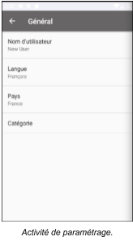
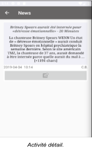

# News
## Projet TPALT 2019.  Sofiane GHERSA.  Développer une application Android “ News “. 

### Introduction

Aujourd’hui on à une difficulté de consulter les sources des journaux électronique, a cause de différentes sources.
J’ai pensé à mettre en oeuvre une application qui facilite la visualisation des articles.
L’utilisateur configure les paramètres de l’application ( Langue, Pays, Catégorie … ), à partir de cette configuration l’application cherche des articles adéquate dans une API open source “ [newsapi](https://newsapi.org/ "") “, on peut aussi faire une recherche, cette application elle permet de sauvegarder ces articles et aller sur le site de la source en un seul click.

 
### Activité 

* Paramétrage : cette activité s’ouvre à l'installation de l’application pour connaître les préférences de l’utilisateur, cette activité est aussi accessible à partir d’un bouton dans le menu.

* Principale : Elle nous affiche des articles rechercher sur l’API, ces articles correspond a nos préférences, et on peux faire une recherche sur la barre dédié ou avec la saisie vocale. 

* Détail : J’ai mis cette activité pour consulter la description d’un article et elle permet de consulter le site de source de cette article.

* Historique : Cette activité elle permet de consulter et supprimer des articles déjà enregistrés pour une lecture ultérieure. 

### Extension

J’ai pensé d’ajouter une fonctionnalité pour les gens non voyants, cette extension leur permet d'utiliser cette application d’une manière facile.
 
Au click sur un article on entend le titre et la description de l’article, au click sur un bouton sur la barre de menu on aura la possibilité de recherche juste par voie.

### Implémentation

J’ai réussi a implémenté une application des news, j’ai appri la mise en page des différents composants “ Layout, bouton, Adapter ... “, et la gestion de logique “ API, SQLite, SharedPreferences, speech to text, text to speech ... ”. ce projet m’a permis de comprendre la logique et le développement Android, des appelles à des api extern, utilisation des base de donnée interne.
  

### Difficulté 

Je dirai pas une difficulté mais un facture de temps qui m’a pas permet de continuer vers la fin de cette application pour internationalisation complets, et aussi la possibilité de partager les articles. Et avoir plus de fonctionnalité.

### Présentation

     

1. Accès au paramétrage.
2. Accès au l’historique.
3. Afficher / Masquer la barre de recherche.
4. Actualisé.
5. Commande vocale. 
6. Barre de recherche.
7. Lecture vocale de titre et description.
8. Enregistrer l’article.
9. Voir la description de l’article.
10. Accès à la source de l’article.
11. Supprimer l’article.
12. Voir la description de l’article.
13. Accès à la source de l’article.

